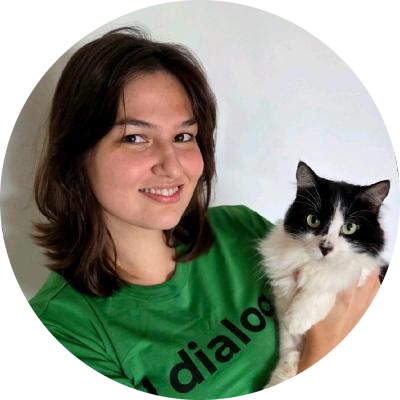
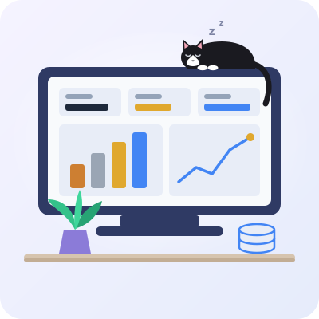

  

---

<table>
<tr>
<td width="70%" valign="middle">

## ✨ Sobre mim
### Olá, eu sou a Cecília! 👋

Sou Analista de Dados Pleno na **SysMap Solutions**. No dia a dia, trabalho com **Databricks**, **PySpark** e **Google Cloud** (BigQuery e Dataform), sempre com SQL e Python.

Também sou voluntária de Pesquisa e Desenvolvimento na **Data Girls**.

💬 Me pergunte sobre **SQL**, **pipelines de dados** e **Power BI** 
📍 São Paulo – SP · ela/dela · português (nativo) e inglês (profissional)

🎓 Formação e cursos

- Análise de Dados de Alta Performance – Universidade Cidade de São Paulo (2024–2026)
- Análise e Desenvolvimento de Sistemas – UNIP (2022–2024)
- Direito – UNIFIPA (2014–2018)
- Cursos: Bootcamp [RE]Start: Dados além da técnica (Data Girls) · Imersão Dados com Python · Storytelling para Negócios

</td>
<td width="30%" align="center">

</td>
</tr>
</table>

---

## Tech Stack

<table align="center">
  <tr align="center">
    <td> Databricks</td>
    <td> Spark / PySpark</td>
    <td> BigQuery</td>
    <td> Dataform</td>
    <td> SQL</td>
    <td> Python</td>
    <td> Pandas</td>
    <td> Airflow</td>
    <td> dbt</td>
  </tr>
  <tr align="center">
    <td> SQL Server</td>
    <td> PostgreSQL</td>
    <td> MySQL</td>
    <td> DuckDB</td>
    <td> Power BI</td>
    <td> Excel</td>
    <td> Git</td>
    <td> APIs REST</td>
    <td> Kanban</td>
  </tr>
</table>

<b>Conceitos:</b> ETL/ELT · Data Lake · Data Warehouse · modelagem de dados · EDA KPIs · monitoramento de pipelines · governança de dados · storytelling com dados

---

## Projetos em destaque

<table>
<tr>
<td width="30%">

</td>
<td width="70%">

**🏗️ Customer Analytics Lakehouse** 
Lakehouse em Databricks com camadas Bronze, Silver e Gold (Delta Lake, Unity Catalog e AWS S3) para analisar ativação, recorrência e cashback de clientes, com dashboard em Power BI. 
🔗 [Ver projeto](https://github.com/CeciliaPerles/Customer-Analytics)

**👥 ReStart Data Girls** 
Projeto final do bootcamp [RE]Start: ETL automatizado com Airflow para análise de turnover (IBM HR Analytics), com carga em AWS S3 e MySQL e dashboard em Power BI. 
🔗 [Ver projeto](https://github.com/CeciliaPerles/ReStart-Data-Girls)

**⚖️ Legal Insights** 
ETL em Python que padroniza planilhas de processos e decisões judiciais e carrega os dados em Parquet e MySQL para análise. 
🔗 [Ver projeto](https://github.com/CeciliaPerles/Legal-Insights)

</td>
</tr>
</table>

---

   
  
  

